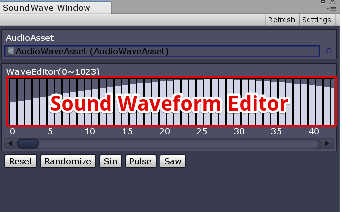
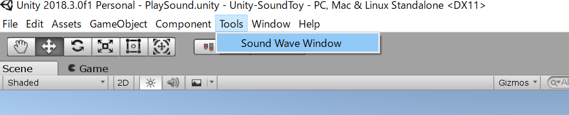
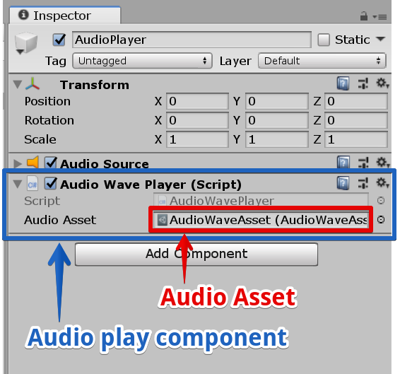

# Unity-SoundToy
Unity-SoundToy contains sound waveform editor.

# How to use
## Open Window
Select "Tools/Sound Wave Window".

## Play sound
Register "AudioWavePlayer" component to GameObject in Hierarchy. 
Sound will play in runtime. 

